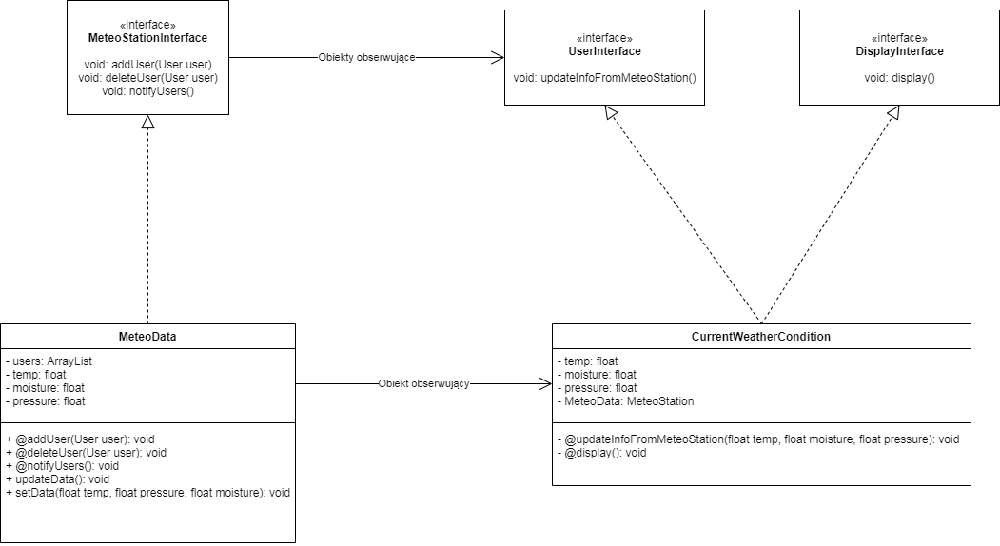

## Table of contents
* [General info](#general-info)
* [Technologies](#technologies)
* [Setup](#setup)

## General info
This project is inspired by:
Chapter two from:
Eric Freeman, Elisabeth Freeman, Bert Bates, Kathy Sierra
2017 Head First Design Patterns

## Technologies
Project is created with:
* Gradle
* JAVA 15.0.1.
* draw.io

## Setup
To run this project, install it locally using:

```
$ 
$ FORK from git
$ 
```
